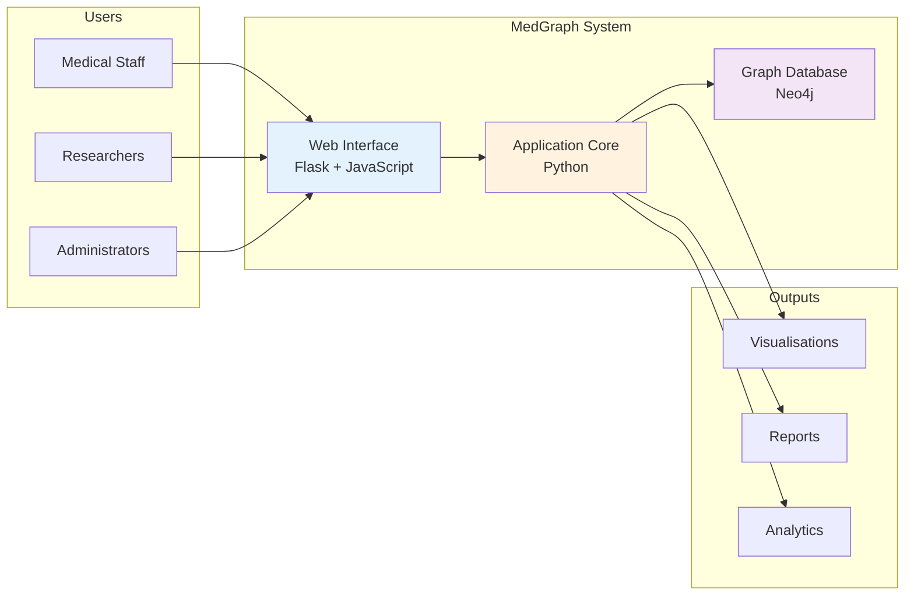
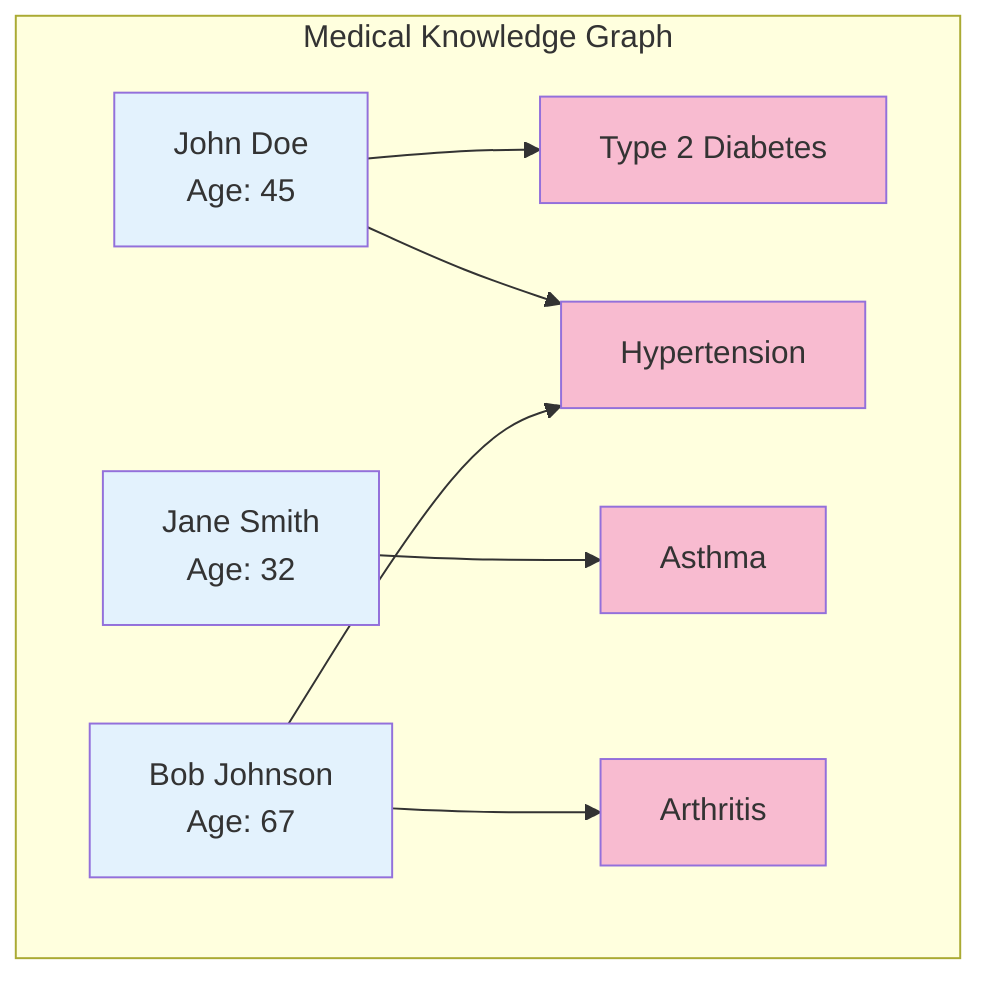
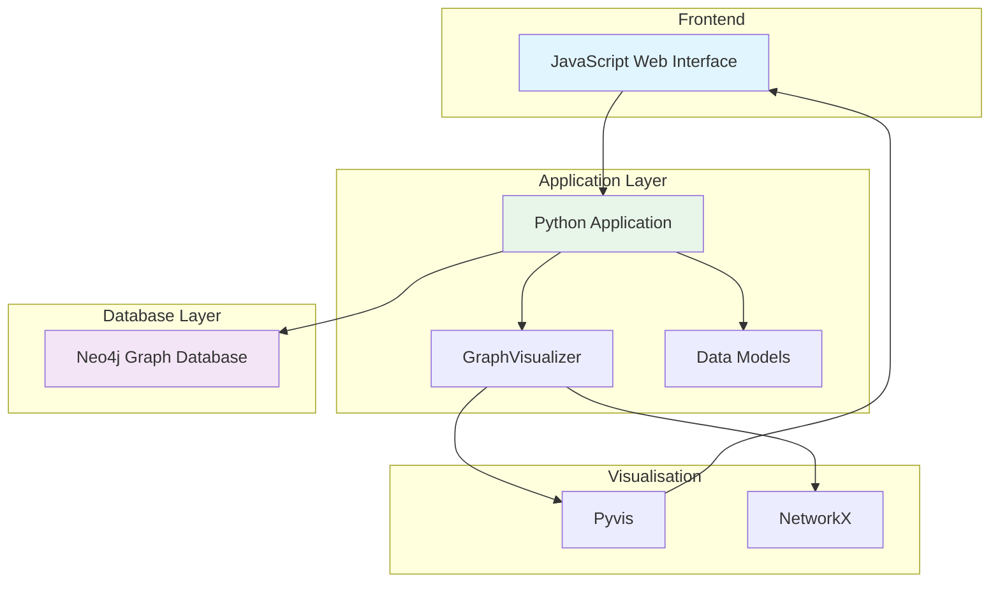
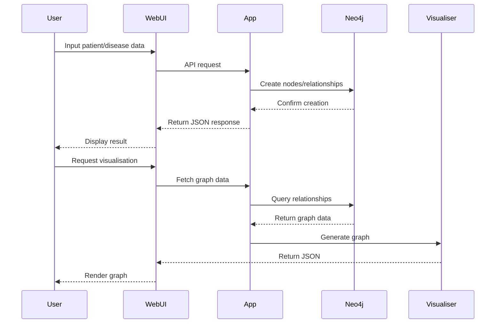
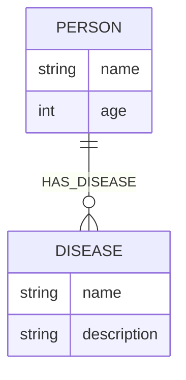
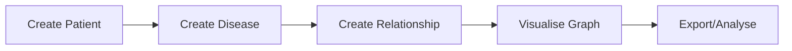

# MedGraph - Medical Knowledge Graph Application

[](https://github.com/your-username/MedGraph/actions/workflows/python-app.yml)
[](https://opensource.org/licenses/MIT)

## Table of Contents

- [Overview](#overview)
- [Architecture](#architecture)
- [Key Features](#key-features)
- [Tech Stack](#tech-stack)
- [Installation](#installation)
- [Configuration](#configuration)
- [Usage](#usage)
- [API Documentation](#api-documentation)
- [Testing](#testing)
- [Deployment](#deployment)
- [CI/CD Pipeline](#cicd-pipeline)
- [Project Structure](#project-structure)
- [Contributing](#contributing)
- [Troubleshooting](#troubleshooting)
- [Performance](#performance)
- [Security](#security)
- [Licence](#licence)
- [Acknowledgements](#acknowledgements)

## Overview

MedGraph is a medical knowledge graph application that demonstrates the integration of **Graph RAG** (Retrieval-Augmented Generation) with **Neo4j** using Python. It provides an intuitive interface to manage medical relationships between patients and diseases, with powerful visualisation capabilities.

### What is MedGraph?

MedGraph transforms traditional patient-disease records into an interconnected knowledge graph, enabling:
- Visual exploration of patient health networks
- Relationship-based queries
- Pattern recognition in disease clusters
- Scalable medical data management

### System Overview



### Demo



### Screenshots

<table>
  <tr>
    <td align="center">
      
      <br/>
      <strong>Hospital Portal</strong>
      <br/>
      <em>Main dashboard for patient and disease management</em>
    </td>
    <td align="center">
      
      <br/>
      <strong>Simple Interface</strong>
      <br/>
      <em>Streamlined view with graph visualization</em>
    </td>
  </tr>
  <tr>
    <td align="center" colspan="2">
      
      <br/>
      <strong>Doctor Portal</strong>
      <br/>
      <em>Advanced features for medical professionals</em>
    </td>
  </tr>
</table>

### Key Features

- **Medical Data Management**: Create and manage patient records and disease information
- **Relationship Mapping**: Establish and track patient-disease relationships
- **Interactive Visualisation**: Real-time graph visualisation using JavaScript and Vis.js
- **Query Capabilities**: Fetch and display disease information for specific patients
- **Containerised Deployment**: Docker support for easy deployment
- **Automated Testing**: Comprehensive test suite with pytest
- **CI/CD Pipeline**: Automated build and deployment with GitHub Actions

## Architecture



### Data Flow Diagram



### Graph Data Model



## Tech Stack

### Core Technologies

| Component | Technology | Version | Purpose |
|-----------|------------|---------|----------|
| Language | Python | 3.9+ | Core application development |
| Database | Neo4j | 4.x+ | Graph database for relationships |
| Backend Framework | Flask | 3.0.0 | REST API server |
| Frontend | JavaScript | ES6+ | Interactive web interface |
| UI Framework | Bootstrap | 5.3.2 | Responsive UI components |
| Graph Visualisation | Pyvis | 0.3.2 | Interactive graph rendering |
| Graph Library | NetworkX | 3.2.1 | Graph algorithms and manipulation |
| Testing | Pytest | 8.3.4 | Unit and integration testing |
| Containerisation | Docker | Latest | Application containerisation |
| CI/CD | GitHub Actions | N/A | Automated testing and deployment |

### System Requirements

- Python 3.9 or higher
- Neo4j 4.x or higher
- 4GB RAM minimum (8GB recommended)
- 10GB free disk space
- Modern web browser (Chrome, Firefox, Safari, Edge)

## Installation

### Prerequisites

Ensure you have the following installed:

1. **Python 3.9+**: Download from [python.org](https://www.python.org/)
2. **Git**: Download from [git-scm.com](https://git-scm.com/)
3. **Neo4j**: Choose one option:
   - Cloud: [Neo4j Aura](https://neo4j.com/cloud/aura/)
   - Local: [Neo4j Desktop](https://neo4j.com/download/)
   - Docker: See deployment section

### Quick Start

1. **Clone the repository**
   ```bash
   git clone https://github.com/your-username/MedGraph.git
   cd MedGraph
   ```

2. **Run the setup script**
   ```bash
   python setup.py
   ```

This will:
- Create a virtual environment
- Install all dependencies
- Create a .env file from template
- Provide next steps

### Manual Installation

If you prefer manual setup:

1. **Create and activate virtual environment**
   ```bash
   python3 -m venv venv
   source venv/bin/activate  # On Windows: venv\Scripts\activate
   ```

2. **Install dependencies**
   ```bash
   pip install -r requirements.txt
   ```

3. **Configure environment**
   ```bash
   cp .env.example .env
   ```

## Configuration

### Environment Variables

Create a `.env` file with the following variables:

```env
# Neo4j Configuration
NEO4J_URI=neo4j+s://your-instance.databases.neo4j.io
NEO4J_USERNAME=neo4j
NEO4J_PASSWORD=your-password

# Application Configuration
APP_HOST=0.0.0.0
APP_PORT=5001
DEBUG=False
```

### Neo4j Setup Options

#### Option 1: Neo4j Aura (Cloud - Recommended)

1. Visit [Neo4j Aura](https://neo4j.com/cloud/aura/)
2. Create a free instance
3. Save your credentials:
   - Connection URI
   - Username
   - Password
4. Update `.env` file

#### Option 2: Local Neo4j

1. Download [Neo4j Desktop](https://neo4j.com/download/)
2. Create a new project
3. Start the database
4. Update `.env` with local connection:
   ```env
   NEO4J_URI=bolt://localhost:7687
   NEO4J_USERNAME=neo4j
   NEO4J_PASSWORD=your-local-password
   ```

#### Option 3: Docker Neo4j

```bash
docker run -d \
  --name neo4j \
  -p 7474:7474 -p 7687:7687 \
  -e NEO4J_AUTH=neo4j/password123 \
  -v $PWD/neo4j/data:/data \
  -v $PWD/neo4j/logs:/logs \
  neo4j:latest
```

### Neo4j Setup

You have several options for setting up Neo4j:

1. **Neo4j Aura (Recommended)**: Free cloud-hosted instance
   - Sign up at [neo4j.com/cloud/aura](https://neo4j.com/cloud/aura)
   - Create a free instance
   - Copy the connection URI and credentials

2. **Local Neo4j**:
   ```bash
   # Using Docker
   docker run -d \
     --name neo4j \
     -p 7474:7474 -p 7687:7687 \
     -e NEO4J_AUTH=neo4j/password \
     neo4j:latest
   ```

## Running the Application

### Option 1: Run Locally

```bash
# Using the run script
./run_app.sh

# Or directly
python app/flask_app.py
```

The application will be available at `http://localhost:5001`.

### Option 2: Run with Docker

1. **Build the Docker image**:

   ```bash
   docker build -t medgraph .
   ```

2. **Run the Docker container**:

   ```bash
   docker run -p 5001:5001 --env-file .env medgraph
   ```

## Usage

### Starting the Application

1. **Development Mode**
   ```bash
   # Using the run script
   ./run_app.sh

   # Or directly
   python app/flask_app.py
   ```

2. **Docker Mode**
   ```bash
   docker run -p 5001:5001 --env-file .env medgraph
   ```

3. **Production Mode**
   ```bash
   export APP_HOST=0.0.0.0
   export APP_PORT=5001
   python app/flask_app.py
   ```

Access the application at `http://localhost:5001`

### Features Overview

#### 1. Patient Management
- Create new patient records with name and age
- View all patients in the system
- Search patients by name

#### 2. Disease Management
- Add new diseases with detailed descriptions
- View all diseases in the database
- Update disease information

#### 3. Relationship Management
- Link patients to diseases
- Remove patient-disease relationships
- View all relationships

#### 4. Data Visualisation
- Interactive graph showing patient-disease networks
- Filter by patient or disease
- Export graph as image

### Example Workflow



## API Documentation

### Core Functions

#### `create_person(name: str, age: int) -> tuple[bool, str]`
Creates a new person node in the database.

**Parameters:**
- `name`: Person's name (required)
- `age`: Person's age (required, must be positive)

**Returns:**
- `(True, success_message)` on success
- `(False, error_message)` on failure

**Example:**
```python
success, message = create_person("John Doe", 45)
```

#### `create_disease(name: str, description: str) -> tuple[bool, str]`
Creates a new disease node in the database.

**Parameters:**
- `name`: Disease name (required)
- `description`: Disease description (required)

**Returns:**
- `(True, success_message)` on success
- `(False, error_message)` on failure

#### `create_relationship(person_name: str, disease_name: str) -> tuple[bool, str]`
Creates a HAS_DISEASE relationship between person and disease.

**Parameters:**
- `person_name`: Name of existing person
- `disease_name`: Name of existing disease

**Returns:**
- `(True, success_message)` on success
- `(False, error_message)` on failure

#### `fetch_person_diseases(name: str) -> list[dict]`
Fetches all diseases associated with a person.

**Parameters:**
- `name`: Person's name

**Returns:**
- List of disease dictionaries with name and description

### Database Schema

```cypher
// Person Node
CREATE (p:Person {
    name: "string",
    age: integer
})

// Disease Node
CREATE (d:Disease {
    name: "string",
    description: "string"
})

// Relationship
CREATE (p:Person)-[:HAS_DISEASE]->(d:Disease)
```

## Testing

### Running Tests

1. **Unit Tests**
   ```bash
   pytest tests/test_main.py -v
   ```

2. **Integration Tests**
   ```bash
   pytest tests/ -v --integration
   ```

3. **Coverage Report**
   ```bash
   pytest tests/ --cov=app --cov-report=html
   open htmlcov/index.html
   ```

### Test Structure

```
tests/
├── test_main.py          # Core functionality tests
├── test_integration.py   # Integration tests
├── test_performance.py   # Performance tests
└── conftest.py          # Test configuration
```

### Writing Tests

```python
def test_create_person():
    """Test person creation."""
    success, message = create_person("Test User", 30)
    assert success == True
    assert "successfully" in message.lower()
```

---

## CI/CD Pipeline

This project uses GitHub Actions for automated testing and deployment:

- **Automated Testing**: Runs tests on Python 3.9, 3.10, and 3.11
- **Docker Build**: Automatically builds and pushes Docker images on main branch
- **Continuous Deployment**: Deploy to your preferred platform

### Required GitHub Secrets

Set these secrets in your GitHub repository settings:

- `DOCKER_USERNAME`: Docker Hub username
- `DOCKER_PASSWORD`: Docker Hub access token
- `NEO4J_URI`: Neo4j database URI
- `NEO4J_USERNAME`: Neo4j username
- `NEO4J_PASSWORD`: Neo4j password

## Project Structure

```
MedGraph/
├── app/                      # Application code
│   ├── main.py              # Core logic and Neo4j interactions
│   ├── flask_app.py         # Flask API backend
│   ├── medical_features.py  # Medical-specific functions
│   ├── rag_assistant.py     # RAG functionality
│   ├── visualizations.py    # Visualization utilities
│   └── __init__.py          # Package initialisation
├── frontend/                 # Web interface
│   ├── hospital.html        # Hospital management portal
│   ├── doctor.html          # Doctor portal
│   ├── index.html           # Simple interface
│   └── static/              # Static assets
│       ├── css/             # Stylesheets
│       │   ├── style.css    # Simple interface styles
│       │   ├── hospital.css # Hospital portal styles
│       │   └── doctor.css   # Doctor portal styles
│       └── js/              # JavaScript
│           ├── app.js       # Simple interface logic
│           ├── hospital.js  # Hospital portal logic
│           └── doctor.js    # Doctor portal logic
├── data/                     # Data files
│   └── diseases_data.py     # Disease dataset
├── scripts/                  # Utility scripts
│   └── load_diseases.py     # Data loader script
├── tests/                    # Test suite
│   ├── test_main.py         # Unit tests
│   └── __init__.py          # Package initialisation
├── lib/                      # Third-party libraries
│   ├── vis-9.1.2/           # Vis.js for graph visualisation
│   └── tom-select/          # Tom Select for dropdowns
├── docs/                     # Documentation
│   └── screenshots/         # UI screenshots
├── .github/                  # GitHub Actions
│   └── workflows/
│       └── python-app.yml   # CI/CD pipeline
├── Dockerfile               # Container configuration
├── requirements.txt         # Python dependencies
├── setup.py                 # Setup script
├── run_app.sh              # Application launcher
├── .env                     # Environment variables
├── LICENCE                 # MIT Licence
└── README.md               # This file
```

---

## Deployment

### Docker Deployment

1. **Build the image**
   ```bash
   docker build -t medgraph:latest .
   ```

2. **Run with Docker Compose**
   ```yaml
   version: '3.8'
   services:
     neo4j:
       image: neo4j:latest
       environment:
         NEO4J_AUTH: neo4j/password123
       ports:
         - "7474:7474"
         - "7687:7687"
       volumes:
         - neo4j_data:/data

     medgraph:
       build: .
       ports:
         - "5001:5001"
       environment:
         NEO4J_URI: bolt://neo4j:7687
         NEO4J_USERNAME: neo4j
         NEO4J_PASSWORD: password123
       depends_on:
         - neo4j

   volumes:
     neo4j_data:
   ```

3. **Deploy to production**
   ```bash
   docker-compose up -d
   ```

### Cloud Deployment

#### AWS Deployment

1. **Using ECS**
   - Push image to ECR
   - Create ECS task definition
   - Deploy service

2. **Using EC2**
   - Launch EC2 instance
   - Install Docker
   - Deploy container

#### Heroku Deployment

1. **Create Heroku app**
   ```bash
   heroku create medgraph-app
   ```

2. **Add Neo4j add-on**
   ```bash
   heroku addons:create graphenedb:dev
   ```

3. **Deploy**
   ```bash
   git push heroku main
   ```

## Troubleshooting

### Common Issues

#### 1. Neo4j Connection Error
```
Error: Unable to connect to Neo4j
```

**Solution:**
- Check Neo4j is running
- Verify credentials in `.env`
- Test connection: `neo4j browser`

#### 2. Module Import Error
```
ModuleNotFoundError: No module named 'app'
```

**Solution:**
```bash
export PYTHONPATH=$PYTHONPATH:$(pwd)
```

#### 3. Port Already in Use
```
Error: Port 5001 is already in use
```

**Solution:**
```bash
# Find process using port
lsof -i :5001
# Kill process or use different port
export APP_PORT=5002
```

### Debug Mode

Enable debug logging:
```bash
export DEBUG=True
export LOG_LEVEL=DEBUG
python app/flask_app.py
```

## Contributing

### Getting Started

1. **Fork the repository**
2. **Clone your fork**
   ```bash
   git clone https://github.com/your-username/MedGraph.git
   cd MedGraph
   ```

3. **Set up development environment**
   ```bash
   python setup.py --dev
   ```

### Development Guidelines

1. **Code Style**
   - Follow PEP 8
   - Use type hints
   - Document all functions

2. **Testing**
   - Write tests for new features
   - Maintain test coverage above 80%
   - Run tests before committing

3. **Commit Messages**
   - Use descriptive commit messages
   - Follow conventional commits format
   - Reference issues when applicable

### Pull Request Process

1. **Create feature branch**
   ```bash
   git checkout -b feature/your-feature
   ```

2. **Make changes and test**
   ```bash
   # Run tests
   pytest tests/

   # Check code style
   black app/ tests/
   flake8 app/ tests/
   ```

3. **Submit pull request**
   - Fill out PR template
   - Link related issues
   - Wait for review

## Licence

This project is licenced under the MIT Licence - see the [LICENCE](LICENCE) file for details.

## Acknowledgments

- [Neo4j](https://neo4j.com/) for the graph database
- [Flask](https://flask.palletsprojects.com/) for the backend API
- [Bootstrap](https://getbootstrap.com/) for UI components
- [Pyvis](https://pyvis.readthedocs.io/) for graph visualisation
- [GitHub Actions](https://github.com/features/actions) for CI/CD

## Support

If you encounter any issues or have questions, please:

1. Check the [Issues](https://github.com/your-username/MedGraph/issues) page
2. Create a new issue if your problem isn't already listed
3. Provide detailed information about your environment and the problem

## Performance

### Benchmarks

| Operation | Average Time | Max Records |
|-----------|-------------|-------------|
| Create Person | < 50ms | N/A |
| Create Disease | < 50ms | N/A |
| Create Relationship | < 100ms | N/A |
| Query Relationships | < 200ms | 1000 |
| Generate Graph | < 500ms | 100 nodes |

### Optimisation Tips

1. **Database Indexing**: Create indexes on frequently queried properties
2. **Connection Pooling**: Use Neo4j driver connection pooling
3. **Caching**: Implement caching for frequently accessed data
4. **Batch Operations**: Use batch operations for bulk data imports

## Security

### Best Practices

1. **Environment Variables**: Never commit sensitive credentials
2. **Input Validation**: All user inputs are validated
3. **SQL Injection Protection**: Neo4j parameterised queries prevent injection
4. **Authentication**: Implement proper authentication for production
5. **HTTPS**: Use HTTPS in production deployments

### Security Checklist

- [ ] Change default Neo4j credentials
- [ ] Use environment variables for all secrets
- [ ] Enable SSL/TLS for Neo4j connections
- [ ] Implement rate limiting
- [ ] Add user authentication
- [ ] Regular security updates

---

## Future Roadmap

### Version 2.0 (Q2 2024)
- [ ] Multi-user support with authentication
- [ ] Role-based access control
- [ ] Advanced graph analytics
- [ ] Export functionality (CSV, JSON)
- [ ] Batch import capability

### Version 2.1 (Q3 2024)
- [ ] Machine learning integration
- [ ] Predictive disease analysis
- [ ] Natural language queries
- [ ] Mobile responsive design

### Version 3.0 (Q4 2024)
- [ ] API endpoints for external integration
- [ ] Webhook support
- [ ] Real-time collaboration
- [ ] Advanced visualisation options

## Resources

### Documentation
- [Neo4j Documentation](https://neo4j.com/docs/)
- [Flask Documentation](https://flask.palletsprojects.com/)
- [Pyvis Documentation](https://pyvis.readthedocs.io/)

### Tutorials
- [Getting Started with Graph Databases](https://neo4j.com/graph-database/)
- [Building Web Apps with Flask](https://flask.palletsprojects.com/tutorial/)
- [Graph Visualisation Best Practices](https://www.data-to-viz.com/graph/network.html)

### Community
- [Discord Server](https://discord.gg/medgraph)
- [Stack Overflow Tag](https://stackoverflow.com/questions/tagged/medgraph)
- [GitHub Discussions](https://github.com/your-username/MedGraph/discussions)

---

## Credits

Developed by the MedGraph Team

### Contributors
- Lead Developer: [Your Name]
- UI/UX Design: [Designer Name]
- Database Architecture: [DBA Name]

### Special Thanks
- Neo4j team for the excellent graph database
- Flask and JavaScript communities for the web stack
- Open source community for continuous support

---

**MedGraph** - Transforming medical data into actionable insights through graph technology.

